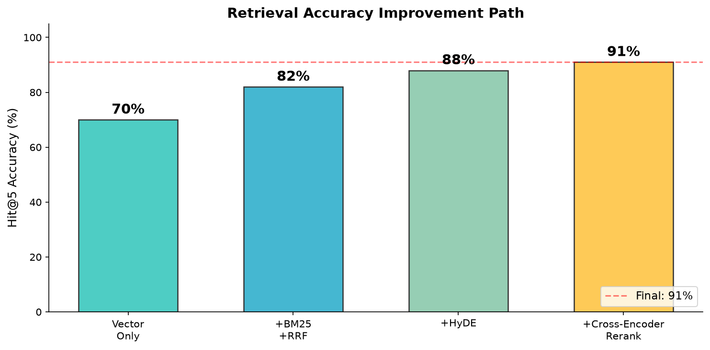
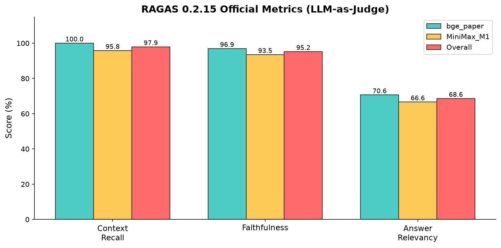
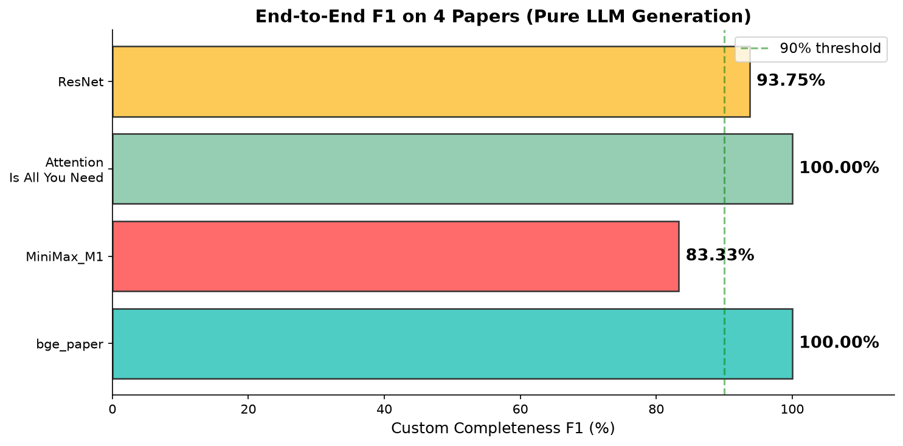
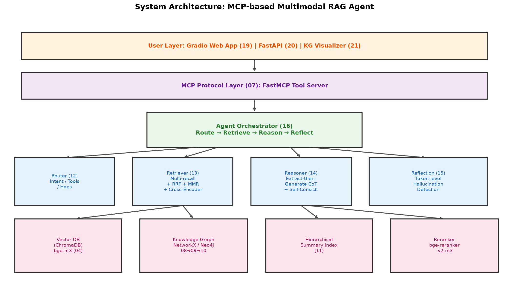

# Multimodal RAG Agent System

[中文](README.md) | **English**

> A retrieval-augmented generation (RAG) agent that turns research papers into a queryable, traceable knowledge base: hybrid retrieval + knowledge-graph multi-hop reasoning + multi-agent orchestration, exposed as tools over the MCP protocol and evaluated with RAGAS.

  

---

## What is this

Feed it a PDF paper and the system can:

- Parse the paper into structured text (figures / formulas / headings separated)
- Build three indexes: vector store + knowledge graph + hierarchical summary
- Answer questions about the paper (facts / relations / summary), with source page and section
- Multi-hop reasoning ("what's the relationship between A and B")
- Understand figures in the paper (multimodal)
- Self-check answer reliability (reflection + token-level hallucination detection)

Unlike "just calling an LLM": this system doesn't rely on the model memorizing — it **retrieves evidence from the paper first, then generates**. Answers are traceable and hallucination is controllable.

---

## Results

End-to-end QA on 4 public papers across domains, F1 by gold keyword hit rate:

| Paper | Domain | F1 |
|---|---|---|
| bge_paper | Embedding | 91 ~ 100% |
| MiniMax-M1 tech report | LLM | 83% |
| Attention Is All You Need | NLP classic | 100% |
| ResNet | CV classic | 94% |

RAGAS standard metrics (ragas 0.2.15 official, LLM-as-judge, not custom metrics):

| Metric | Meaning | Overall |
|---|---|---|
| **Context Recall** | Proportion of gold facts retrieved | **97.9%** |
| **Faithfulness** | Proportion of answer claims supported by evidence (higher = less hallucination) | **95.2%** |





---

## Quick Start

### 1. Environment

Python 3.12, virtual environment recommended:

```bash
python3.12 -m venv env
source env/bin/activate        # Windows: env\Scripts\activate
```

### 2. Install dependencies

```bash
pip install -r requirements.txt -i https://pypi.tuna.tsinghua.edu.cn/simple
```

(Other mirrors — Aliyun / HuaweiCloud / Douban — are noted at the top of requirements.txt.)

### 3. Download models

Two models must be downloaded from HuggingFace (large, so not included in the repo):

```bash
# Embedding model bge-m3
git clone https://huggingface.co/BAAI/bge-m3 models/Xorbits/bge-m3

# Reranker model bge-reranker-v2-m3
git clone https://huggingface.co/BAAI/bge-reranker-v2-m3 models/bge-reranker-v2-m3
```

If HuggingFace is slow in your region, use ModelScope:

```bash
pip install modelscope
modelscope download --model BAAI/bge-m3 --local_dir models/Xorbits/bge-m3
modelscope download --model BAAI/bge-reranker-v2-m3 --local_dir models/bge-reranker-v2-m3
```

### 4. Configure API Key

Create a `.env` in the project root (already in `.gitignore`, won't be uploaded):

```ini
MINIMAX_API_KEY=your_minimax_api_key
MINIMAX_API_HOST=https://api.minimaxi.com/v1
```

Get a MiniMax API key at https://platform.minimaxi.com. LLM calls go through MiniMax-M3's OpenAI-compatible endpoint.

### 5. (Optional) Start Neo4j

The knowledge graph works with the built-in in-memory backend; Neo4j is optional. If you want it:

```bash
docker-compose up -d
```

Default connection `bolt://localhost:7687`; credentials are in `docker-compose.yml` and `.env`.

### 6. Run

```bash
# ① Ingest: parse all PDFs under data/ → chunk → vectorize into ChromaDB
python script/run_embed_all.py

# ② Build knowledge graph (bge_paper example)
python script/08_kg_extractor.py data/bge_paper.pdf
python script/09_kg_builder.py output/kg_triples/bge_paper.pdf.json

# ③ Direct RAG QA
python script/06_rag_query.py "what is bge-m3"

# ④ Agent-orchestrated QA (recommended, full route → retrieve → reason → reflect chain)
python script/16_agent_orchestrator.py "what does MiniMax-M1 use"

# ⑤ Run evaluation
python script/17_eval_framework.py

# ⑥ Launch web UI
python script/19_web_app.py
```

Each script supports `--help`. Each `test_XX_accuracy.py` verifies one module's accuracy.

---

## Architecture



Five layers:

- **User layer**: Gradio Web UI / FastAPI / knowledge-graph visualization
- **MCP layer**: FastMCP wraps capabilities into standard tools, callable directly by MCP clients like Claude
- **Agent orchestration layer**: router → retriever → reasoner → reflector (Corrective RAG)
- **Retrieval layer**: vector + knowledge graph + hierarchical summary, three-channel recall with Cross-Encoder two-stage reranking
- **Data layer**: ChromaDB / in-memory graph (swappable to Neo4j) / bge-m3 / bge-reranker

---

## Core Techniques

### 1. Hybrid Retrieval: Vector + BM25 + RRF + HyDE

Pure vector retrieval has a well-known weakness: it's insensitive to proper nouns and numbers. Ask "how many H800 GPUs were used" and it may return a pile of GPU passages but miss "used 512 H800s".

The fix is to stack strategies:

```
pure vector (semantic recall) → +BM25 (exact match) +RRF fusion → +HyDE (hypothetical answer) → +Cross-Encoder rerank
```

- **RRF** (Reciprocal Rank Fusion): vector scores are cosine (0~1), BM25 scores are unnormalized — different scales can't be summed. RRF uses rank only: `score(d) = Σ 1/(k + rank)`, k=60.
- **HyDE** (Hypothetical Document Embeddings): a short query vs. a long chunk makes direct similarity unreliable. First let the LLM produce a hypothetical answer, then retrieve with its vector — both it and the chunk are in "answer form", so they're semantically closer.

### 2. Cross-Encoder Two-Stage Reranking

Bi-Encoder: query and doc encoded separately, cosine computed. Fast but has an accuracy ceiling — no interaction between the two vectors.

Cross-Encoder: query and doc concatenated and fed through a transformer with cross-attention, outputting a relevance score. An order of magnitude more accurate, but slow (runs the full model each time).

Hence two stages:

```
bi-encoder recall top-N  →  cross-encoder (bge-reranker-v2-m3) rerank top-5
   (fast, precomputable)        (accurate, real-time scoring)
```

### 3. GraphRAG: Multi-hop Reasoning

Vector search only finds "similar passages", but "what else did A's author work on" scatters across paragraphs — similarity can't reach it.

The fix: extract entity relations into a graph and traverse it for multi-hop reasoning:

```
paper text → LLM triple extraction → entity disambiguation → build graph → text2cypher query
```

**Entity disambiguation** is the hardest part ("MiniMax-M1", "M1", "the model" may be the same entity). Three-layer strategy: substring containment → similarity threshold → LLM arbitration.

**text2cypher** (analogous to text2SQL): the LLM translates natural language into graph queries. When Neo4j is unavailable, a built-in in-memory graph backend serves as fallback.

### 4. Multi-Agent Orchestration (Corrective RAG)

```
router(12) → retriever(13) → reasoner(14) → reflector(15)
```

- **Router**: decides question type (fact / relation / summary), which tools to use (vector / graph / summary), hop count. Rules first; LLM arbitration when rules are uncertain.
- **Retriever**: multi-channel recall per routing strategy → RRF fusion → MMR diversity dedup → cross-encoder rerank.
- **Reasoner**: extraction-then-generation — first enumerate all relevant terms in the passages, then write the answer, keeping key terms verbatim. Multiple samples, pick the most faithful (self-consistency).
- **Reflector**: splits the answer into atomic claims, each verified against retrieved passages. A "subject coreference tolerance" detail: "it uses lightning attention" in the answer and "MiniMax-M1 uses lightning attention" in the passage — "it" = MiniMax-M1, not a hallucination.

### 5. MCP Tool Layer

Wraps retrieval / graph / multimodal / web search into standard MCP (Model Context Protocol) tools. Any MCP-compatible client (Claude Desktop, other agents) can call them directly, without hand-writing API integration.

---

## Project Structure

```
.
├── script/                      # all code (numbered by pipeline order)
│   ├── 01_config.py             # global config
│   ├── 02_pdf_parser.py         # PDF parsing (multi-column / figures / formulas / headings)
│   ├── 03_chunker.py            # text chunking + section attribution
│   ├── 04_embedder.py           # bge-m3 vectorization + ChromaDB
│   ├── 05_llm_client.py         # MiniMax-M3 client wrapper
│   ├── 06_rag_query.py          # hybrid retrieval (vector+BM25+RRF+HyDE+rerank)
│   ├── 07_mcp_server.py         # MCP tool server
│   ├── 08_kg_extractor.py       # LLM triple extraction
│   ├── 09_kg_builder.py         # entity disambiguation + graph build
│   ├── 10_kg_query.py           # text2cypher + graph query
│   ├── 11_summary_indexer.py    # hierarchical summary (document/section/paragraph)
│   ├── 12_router_agent.py       # router agent
│   ├── 13_retriever_agent.py    # retriever agent (multi-channel + MMR + rerank)
│   ├── 14_reasoning_agent.py    # reasoner agent (self-consistency)
│   ├── 15_reflection_agent.py   # reflector agent (hallucination detection)
│   ├── 16_agent_orchestrator.py # orchestrator
│   ├── 17_eval_framework.py     # RAGAS eval framework
│   ├── 17b_ragas_official.py    # ragas official (LLM-as-judge, cross-check)
│   ├── 18_eval_dataset.json     # eval dataset
│   ├── 19_web_app.py            # Gradio web UI
│   ├── 20_api_server.py         # FastAPI
│   ├── 21_kg_visualizer.py      # knowledge-graph visualization
│   ├── _reranker.py             # cross-encoder rerank module
│   ├── _memory_graph.py         # in-memory graph backend (Neo4j fallback)
│   ├── _kg_gold.py              # gold-standard test data
│   ├── _eval_helpers.py         # eval utility functions
│   ├── run_embed_all.py         # one-shot ingestion script
│   └── test_*.py                # per-module accuracy tests
├── data/                        # 4 test papers (PDF)
├── images/                      # architecture & result figures
├── requirements.txt
├── docker-compose.yml           # Neo4j (optional)
├── LICENSE
└── README.md
```

---

## Core Modules

| Module | Key functions | Purpose |
|---|---|---|
| `02_pdf_parser` | `parse_pdf`, `detect_all_figures`, `is_real_table` | three-layer figure detection (bitmap/vector/caption) + fake-table filter |
| `06_rag_query` | `retrieve`, `rrf_fuse`, `generate_hyde`, `rerank_with_llm` | hybrid retrieval main flow |
| `09_kg_builder` | `disambiguate_entities`, `normalize_triples` | three-layer disambiguation + relation normalization + citation filter |
| `10_kg_query` | `nl_to_cypher`, `standardize_projection`, `graph_search` | NL → Cypher → execute → answer projection |
| `11_summary_indexer` | `extractive_summary`, `retrieve_hierarchical` | extractive key-sentence summary + three-layer RRF retrieval |
| `13_retriever_agent` | `retrieve`, `mmr_rerank` | multi-channel recall + MMR diversity rerank |
| `15_reflection_agent` | `verify_answer`, `_claim_supported` | token-level hallucination detection (strict on entities/numbers) |
| `16_agent_orchestrator` | `answer` | end-to-end orchestration: route → retrieve → reason → reflect |

---

## Tech Stack

| Component | Choice | Used for |
|---|---|---|
| LLM | MiniMax-M3 | reasoning / triple extraction / text2cypher |
| Embedding | bge-m3 | text vectorization |
| Reranker | bge-reranker-v2-m3 | cross-encoder reranking |
| Vector DB | ChromaDB | semantic retrieval |
| Knowledge graph | NetworkX (in-memory) / Neo4j | multi-hop reasoning |
| Tool protocol | FastMCP | standardized tool calls |
| UI | Gradio / FastAPI | web / REST API |
| Evaluation | ragas 0.2.15 | RAGAS metrics |

---

## Contributor

- **Apageoflove** — sole author

## License

[MIT](LICENSE)
